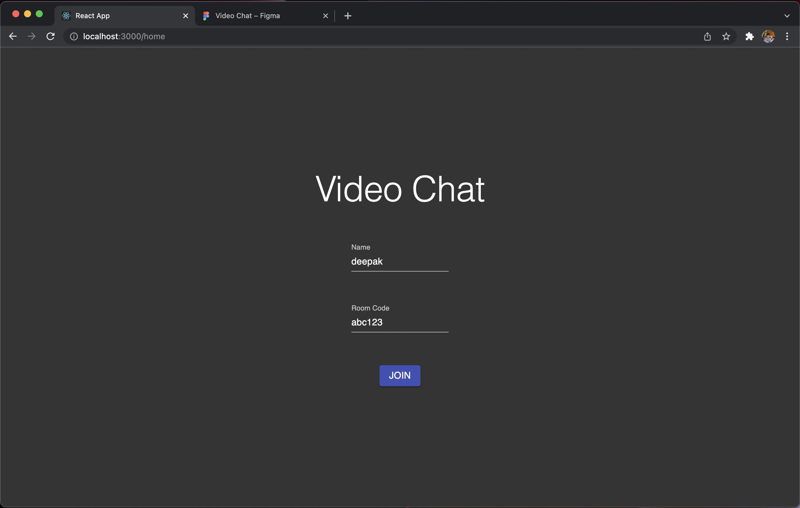
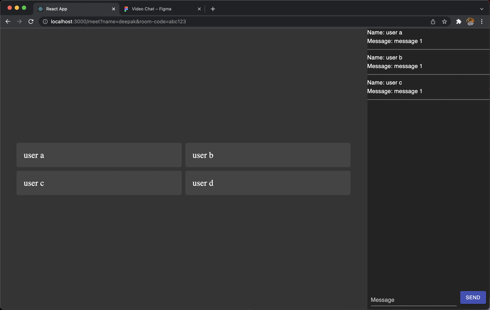

# web-video-chat

## About

Tutorial on how to create a Zoom 'clone' in the web

## Author

Deepak Ramalingam

## Table of Contents

1. [ Part 00 - Mockup and Frontend Setup ](#part00)
2. [ Part 01 - Software Setup ](#part01)
3. [ Part 02 - Project Setup ](#part02)
4. [ Part 03 - React Router Setup ](#part03)
5. [ Part 04 - Implementing Our Mockup ](#part04)
6. [ Part 05 - Getting Started with Backend ](#part05)

<a name="part00"></a>
## Part 00 - Mockup and Frontend Setup
Goal: Create a rough mockup of your web app in Figma (https://www.figma.com/)

Example: https://www.figma.com/file/MXK5OCYonbfN5staFvhB13/Video-Chat?node-id=0%3A1

Tips:
- To create a screen, just create a big rectangle
- You can copy and paste elements (buttons, text fields, etc.) from other Figma projects like these ones:
  - https://www.figma.com/file/9bhIrgZ7ubfDID7NLCq4Ld/MUI-for-Figma-v5.0.1-(Free)-(Community)?node-id=4408%3A773
  - https://www.figma.com/file/9bhIrgZ7ubfDID7NLCq4Ld/MUI-for-Figma-v5.0.1-(Free)-(Community)?node-id=4213%3A8332
  - https://www.figma.com/file/9bhIrgZ7ubfDID7NLCq4Ld/MUI-for-Figma-v5.0.1-(Free)-(Community)
- You can group multiple items together by command / control clicking on them, then right click and press 'group'

<a name="part01"></a>
## Part 01 - Software Setup

Goal: Install the necessary software and development tools on your computer

### Prerequisites (windows)

Before following this tutorial, please understand how to use the 'dir', 'cd', 'rmdir', and 'mkdir' commands in your terminal application.

List of terminal commands for Windows:
- https://www.thomas-krenn.com/en/wiki/Cmd_commands_under_Windows

### Prerequisites (macOS / linux)

Before following this tutorial, please understand how to use the 'ls', 'cd', 'rm', and 'mkdir' commands in your terminal application.

List of terminal commands for macOS / Linux:
- https://dev.to/kymiddleton/reference-guide-common-commands-for-terminal-6no

### Software Required (Windows)
- Install Node.js: https://nodejs.org/en/download/
- IDE (install one of the following):
  - Recommended: https://www.jetbrains.com/webstorm/download/#section=windows
    - Apply for a free license for students using this link: https://www.jetbrains.com/community/education/#students
  - Other: https://code.visualstudio.com/
- Install git on Windows: https://git-scm.com/download/win

### Software Required (Linux)
- Install Node.js: https://nodejs.org/en/download/
- IDE (install one of the following):
  - Recommended: https://www.jetbrains.com/webstorm/download/#section=linux
    - Apply for a free license for students using this link: https://www.jetbrains.com/community/education/#students
  - Other: https://code.visualstudio.com/
- Run the following command in your terminal application to install git on Linux:
```shell
sudo apt-get update
sudo apt install git-all
```

### Software Required (macOS)
- Install Node.js: https://nodejs.org/en/download/
- IDE (install one of the following):
  - Recommended: https://www.jetbrains.com/webstorm/download/#section=mac
    - Apply for a free license for students using this link: https://www.jetbrains.com/community/education/#students
  - Other: https://code.visualstudio.com/
- Run the following command in your terminal application to install git on macOS:
```shell
/bin/bash -c "$(curl -fsSL https://raw.githubusercontent.com/Homebrew/install/HEAD/install.sh)"
brew install git
```

Run the following command in your terminal after installing Node.js on macOS:

```shell
sudo chown -R $USER /usr/local/lib/
sudo chown -R $USER /usr/local/lib/node_modules/
sudo chown -R $USER /usr/local/bin/
sudo chown -R $USER /usr/local/share/
```

<a name="part02"></a>
## Part 02 - Project Setup (https://youtu.be/UdC2CUp6if8)

Goal: Create the skeleton for this project (folder for server code and folder for website code) and push the code to GitHub

Video: https://youtu.be/UdC2CUp6if8

Note: For Windows, use 'dir' instead of 'ls', and 'rd /s /q' instead of 'rm -rf'

How to setup the skeleton for the project:

```shell
# I first created a new folder called 'Projects' in my 'Documents' folder
ls                # 'ls' allows us to see where we are
cd Documents
mkdir Projects
cd Projects

# I then create another new folder called 'web-video-chat'
mkdir web-video-chat
cd web-video-chat

# In here, we will create a folder called 'server' for all our Node.js server
# And we will create another folder called 'web-app' for our React web application code

# first, we will create a blank npm project for the server application
mkdir server
cd server
npm init -y
# its good practice to add a '.gitignore' file so that git does not push folders like 'node_modules'
# download this file and add it to this server folder: https://raw.githubusercontent.com/rdeepak2002/web-video-chat/main/server/.gitignore

# leave this folder
cd ..

# then, we will create the web application
npx create-react-app web-app -y
cd web-app
# remove current git repo inside
rm -rf .git
# optional: running 'npm start' will make the web app run
# press 'control + c' in your terminal application to terminate the process
npm start

# leave this folder
cd ..
```

How to push this code to git:

- Create an account at https://github.com/
- Go to the 'Repositories' section and click 'New' / 'Create'
  - Type in a name for the repository
  - Click 'Create Repository'
- Run the following terminal commands:

```shell
git init
git add .
git commit -m "first commit"
git branch -M main
git remote add origin https://github.com/[YOUR_USERNAME]/[REPO_NAME].git
git push -u origin main
```

- If you are asked to login, type in your username and for the password, generate a new token using this link: https://github.com/settings/tokens/new
  - Select all the scopes
  - Paste in the token string as your password

How to push new code to git:

```shell
# in the root directory of your project, run the following terminal commands
git add .
git commit -m "some commit message"
git push -u origin main
```

<a name="part03"></a>
## Part 03 - React Router Setup

First, we will add routing to our website.

Example of routing:
- https://www.website.com/features/ shows the "features" page
- https://www.website.com/website-templates/ shows the "website-templates" page

A popular library for implementing routing in React is the React Router library: https://reactrouter.com/docs/en/v6/getting-started/tutorial

To install it, run the following command in your web-app folder:

```shell
cd web-app
npm install react-router-dom --save
```

Then modify the content of "src/App.js" to have two routes (one for our home page and another for the video chat page):

```jsx
import {
  BrowserRouter as Router,
  Routes,
  Route,
  Navigate
} from "react-router-dom";

export const k_home_route = "/home";
export const k_video_chat_route = "/meet";

const HomePage = () => {
  return (
          <div>
            Hello world from home page
          </div>
  );
}

const VideoChatPage = () => {
  return (
          <div>
            Hello world from video chat page
          </div>
  );
}

const App = () => {
  return (
      <Router>
        <div>
          {/* A <Switch> looks through its children <Route>s and
            renders the first one that matches the current URL. */}
          <Routes>
            <Route path={k_home_route} element={<HomePage />} />
            <Route path={k_video_chat_route} element={<VideoChatPage />} />
            <Route path="*" element={<Navigate to={k_home_route}/>} />
          </Routes>
        </div>
      </Router>
  );
}

export default App;
```

Run the app using "npm start" in the web-app folder.

Notice the following:
- http://localhost:3000/home will show us the home page
- http://localhost:3000/meet will show us the video chat page
- We added a "Navigate" element at the end of Routes to have the website redirect to the home page if the URL is not recognized
  - Ex: http://localhost:3000/asdf will redirect to http://localhost:3000/home

After this, we will move the "HomePage" and "VideoChatPage" components to separate files.

Create a new file in web-app/src/component/HomePage called "index.jsx" with the following content:

```jsx
const HomePage = () => {
    return (
        <div>
            Hello world from home page
        </div>
    );
}

export default HomePage;
```

Create a new file in web-app/src/component/VideoChatPage called "index.jsx" with the following content:

```jsx
const VideoChatPage = () => {
  return (
          <div>
            Hello world from video chat page
          </div>
  );
}

export default VideoChatPage;
```

Modify App.js to refer to these new files:

```jsx
import {
  BrowserRouter as Router,
  Routes,
  Route,
  Navigate
} from "react-router-dom";
import VideoChatPage from "./component/VideoChatPage";
import HomePage from "./component/HomePage";

export const k_home_route = "/home";
export const k_video_chat_route = "/meet";

const App = () => {
  return (
      <Router>
        <div>
          {/* A <Switch> looks through its children <Route>s and
            renders the first one that matches the current URL. */}
          <Routes>
            <Route path={k_home_route} element={<HomePage />} />
            <Route path={k_video_chat_route} element={<VideoChatPage />} />
            <Route path="*" element={<Navigate to={k_home_route}/>} />
          </Routes>
        </div>
      </Router>
  );
}

export default App;
```

Good job, you set up routing on your website!

<a name="part04"></a>
## Part 04 - Implementing our Mockup

To start implementing our Mockup (https://www.figma.com/file/MXK5OCYonbfN5staFvhB13/Video-Chat?node-id=0%3A1), we will first install a UI library.

UI libraries make it easier to develop since we do not have to write our own custom CSS.

Popular UI libraries include Bootstrap (https://getbootstrap.com/) and Material UI (https://mui.com/)

For this tutorial, I will be using Material UI. To install, it run the following terminal command in the web-app folder.

```shell
cd web-app
npm install @mui/material @emotion/react @emotion/styled --save
```

First, we will fix some of the CSS (styling) for our webpage. Replace web-app/src/index.css with the following:

```css
body {
  margin: 0;
  background: black;
}

#root {
  height: 100%;
  position: absolute;
  left: 0;
  width: 100%;
  overflow: hidden;
}
```

This will make our webpage take up the entire width and height of the screen.

Then, we will add a Material UI Theme to our application. This will make it so that coloring and styles can be consistent throughout our app. We can even setup a system to switch between dark mode and light mode.

Modify web-app/src/App.js to wrap the entire application with a ThemeProvider component:

```js
import {BrowserRouter as Router, Navigate, Route, Routes} from "react-router-dom";
import VideoChatPage from "./component/VideoChatPage";
import HomePage from "./component/HomePage";
import {createTheme, ThemeProvider} from "@mui/material";
import {green, purple} from "@mui/material/colors";

export const k_home_route = "/home";
export const k_video_chat_route = "/meet";

const theme = createTheme({
    palette: {
        mode: 'dark',
        primary: {
            main: purple[500],
        },
        secondary: {
            main: green[500],
        },
    },
});

const App = () => {
    return (
        <Router>
            <ThemeProvider theme={theme}>
                {/* A <Switch> looks through its children <Route>s and
                renders the first one that matches the current URL. */}
                <Routes>
                    <Route path={k_home_route} element={<HomePage/>}/>
                    <Route path={k_video_chat_route} element={<VideoChatPage/>}/>
                    <Route path="*" element={<Navigate to={k_home_route}/>}/>
                </Routes>
            </ThemeProvider>
        </Router>
    );
}

export default App;
```

Modify web-app/src/component/HomePage/index.jsx to use this theme:

```jsx
import {Box, Typography} from "@mui/material";

const HomePage = () => {
    return (
        <Box
            sx={{
                display: 'flex',
                width: '100%',
                height: '100%',
                alignItems: 'center',
                justifyContent: 'center',
                bgcolor: 'background.default',
                color: 'text.primary'
            }}
        >
            <Typography>Home Page</Typography>
        </Box>
    );
}

export default HomePage;
```

Modify web-app/src/component/VideoChatPage/index.jsx to use this theme:

```jsx
import {Box, Typography} from "@mui/material";

const VideoChatPage = () => {
    return (
        <Box
            sx={{
                display: 'flex',
                width: '100%',
                height: '100%',
                alignItems: 'center',
                justifyContent: 'center',
                bgcolor: 'background.default',
                color: 'text.primary'
            }}
        >
            <Typography>Video Chat Page</Typography>
        </Box>
    );
}

export default VideoChatPage;
```

Now, we should see the Home Page and Video Chat Pages having a black background with white text.

After this, we will implement our mockup.

We will also use some basic React code to have the Home Page navigate to the Video Chat Page and pass along the inputted data via the url.

We will also use the 'qs' library to parse data from the URL. Install it with the following commands:

```shell
cd web-app
npm install qs --save
```

This is what web-app/src/App.js looks like:

```js
import {BrowserRouter as Router, Navigate, Route, Routes} from "react-router-dom";
import VideoChatPage from "./component/VideoChatPage";
import HomePage from "./component/HomePage";
import {createTheme, ThemeProvider} from "@mui/material";

// constants to keep track of url routes
export const k_home_route = "/home";
export const k_video_chat_route = "/meet";

// setup dark theme for app
const theme = createTheme({
    palette: {
        mode: 'dark',
        primary: {
            main: '#3F51B5',
        },
        background: {
            default: '#343434',
            darker: '#232323',
            darkest: '#151515'
        }
    },
});

// setup routes and theme for app
const App = () => {
    return (
        <ThemeProvider theme={theme}>
            <Router>
                {/* A <Router> looks through its children <Route>s and
                renders the first one that matches the current URL. */}
                <Routes>
                    <Route path={k_home_route} element={<HomePage/>}/>
                    <Route path={k_video_chat_route} element={<VideoChatPage/>}/>
                    <Route path="*" element={<Navigate to={k_home_route}/>}/>
                </Routes>
            </Router>
        </ThemeProvider>
    );
}

export default App;
```

This is what web-app/src/component/HomePage/index.jsx looks like:

```jsx
import {Box, Button, Grid, TextField, Typography} from "@mui/material";
import {createSearchParams, useNavigate} from "react-router-dom";
import {useState} from "react";
import {k_video_chat_route} from "../../App";

// constants to keep track of
export const k_name_search_param = 'name';
export const k_room_code_search_param = 'room-code';

// landing page
const HomePage = () => {
    // keep track of what the user inputs (their name and meeting id)
    const [userName, setUserName] = useState('');
    const [roomCode, setRoomCode] = useState('');

    // function to navigate between pages
    const navigate = useNavigate();

    // function called when clicking JOIN button
    const handleFormSubmission = () => {
        // create the search params
        // ex search params: "name=deepak&room-code=abc123" from http://localhost:3000/meet?name=deepak&room-code=abc123
        const searchParms = createSearchParams([
            [k_name_search_param, userName],
            [k_room_code_search_param, roomCode]
        ]);

        // then navigate to this new url which has the user's name and their inputted room code
        // ex url: http://localhost:3000/meet?name=deepak&room-code=abc123
        navigate({
            pathname: k_video_chat_route,
            search: `?${searchParms}`,
        });
    }

    // function to return true if input fields have valid input
    const validInputs = () => {
        return userName.trim().length > 0 && roomCode.trim().length > 0;
    }

    // render the page
    return (
        // Container for this page
        <Box
            sx={{
                display: 'flex',
                flexDirection: 'column',
                alignItems: 'center',
                justifyContent: 'center',
                width: '100%',
                height: '100%',
                bgcolor: 'background.default',
                color: 'text.primary'
            }}
        >
            {/*Encapsulate all items in a grid so we can specify spacing between them*/}
            <Grid container direction={"column"} spacing={7} sx={{
                display: 'flex',
                alignItems: 'center',
                justifyContent: 'center',
            }}>
                {/*Video Chat text at top of page*/}
                <Grid item>
                    <Typography variant={'h2'}>Video Chat</Typography>
                </Grid>

                {/*Text field for inputting name*/}
                <Grid item>
                    <TextField id="name-input" label="Name" variant="standard" type={"text"} value={userName}
                               onChange={(event) => {
                                   // function called when input field is changed
                                   setUserName(event.target.value);
                               }}/>
                </Grid>

                {/*Text field for inputting meeting id*/}
                <Grid item>
                    <TextField id="meeting-id-input" label="Room Code" variant="standard" type={"text"} value={roomCode}
                               onChange={(event) => {
                                   // function called when input field is changed
                                   setRoomCode(event.target.value);
                               }}/>
                </Grid>

                {/*Button for joining a meeting after inputting the above information*/}
                <Grid item>
                    <Button variant="contained" type="submit" onClick={() => handleFormSubmission()}
                            disabled={!validInputs()}>
                        <Typography variant={'body1'}>JOIN</Typography>
                    </Button>
                </Grid>
            </Grid>
        </Box>
    );
}

export default HomePage;
```

This is what web-app/src/component/VideoChatPage/index.jsx looks like:

```jsx
import {Box, Button, FormGroup, Grid, TextField, Typography} from "@mui/material";
import {useEffect, useState} from "react";
import {useLocation, useNavigate} from "react-router-dom";
import qs from "qs";
import {k_video_chat_route} from "../../App";
import {k_name_search_param, k_room_code_search_param} from "../HomePage";

// keep track of possible status for clients
const k_connected_status = "connected";

// video chatting page
const VideoChatPage = () => {
    // keep track of what the user's name and the room code
    const [userName, setUserName] = useState('');
    const [roomCode, setRoomCode] = useState('');

    // keep track of video clients
    const [clients, setClients] = useState({
            'id1': {
                socketId: 'id1',
                name: 'user a',
                status: k_connected_status
            },
            'id2': {
                socketId: 'id2',
                name: 'user b',
                status: k_connected_status
            },
            'id3': {
                socketId: 'id3',
                name: 'user c',
                status: k_connected_status
            },
            'id4': {
                socketId: 'id4',
                name: 'user d',
                status: k_connected_status
            },
    });

    // keep track of chat messages
    const [chatMessages, setChatMessages] = useState([
        {
            guid: 'guid1',
            socketId: 'id1',
            message: 'message 1'
        },
        {
            guid: 'guid2',
            socketId: 'id2',
            message: 'message 1'
        },
        {
            guid: 'guid3',
            socketId: 'id3',
            message: 'message 1'
        },
    ]);

    // get the search string, ex: "?name=deepak&room-code=abc123"
    const { search } = useLocation();

    // function to navigate between pages
    const navigate = useNavigate();

    // every time the search string changes (should happen only once), run this function
    useEffect(() => {
        // navigate to home if search params are empty
        if (!search || search.length <= 0) {
            navigate(k_video_chat_route);
            return;
        }

        // remove the question mark present in the beginning of search params
        const searchWithoutQuestionMark = search.substring(1);
        const parsedSearch = qs.parse(searchWithoutQuestionMark);

        // get the name of person and room code from search params
        const nameFromSearch = parsedSearch[k_name_search_param];
        const roomCodeFromSearch = parsedSearch[k_room_code_search_param];

        // navigate to home if search params are not valid
        if(!nameFromSearch || nameFromSearch.length <= 0 || !roomCodeFromSearch || roomCodeFromSearch.length <= 0) {
            navigate(k_video_chat_route);
            return;
        }

        // otherwise if everything is valid and we were able to get the search params, store these as variables
        setUserName(nameFromSearch);
        setRoomCode(roomCodeFromSearch);
    }, [search]);

    // render the page
    return (
        <Box
            sx={{
                display: 'flex',
                flexDirection: 'row',
                alignItems: 'center',
                justifyContent: 'center',
                width: '100%',
                height: '100%',
                bgcolor: 'background.default',
                color: 'text.primary'
            }}
        >
            <Grid container direction={"row"} spacing={0} sx={{
                display: 'flex',
                alignItems: 'stretch',
                justifyContent: 'center',
                width: '100%',
                height: '100%'
            }}>
                <VideoFeeds clients={clients} />
                <Chat clients={clients} chatMessages={chatMessages} />
            </Grid>
        </Box>
    );
}

const VideoFeeds = (props) => {
    return(
        <Grid item xs={9}>
            <Box
                sx={{
                    display: 'flex',
                    flexDirection: 'column',
                    alignItems: 'center',
                    justifyContent: 'center',
                    width: '100%',
                    height: '100%',
                    bgcolor: 'background.default',
                    color: 'text.primary'
                }}
            >
                <div className="video-feeds-wrapper">
                    {
                        Object.keys(props.clients).map((clientId) => {
                            const client = props.clients[clientId];

                            if(client.status === k_connected_status) {
                                return (
                                    <div key={clientId} className="video-feed">{client.name}</div>
                                );
                            }
                        })
                    }
                </div>
            </Box>
        </Grid>
    );
}

const Chat = (props) => {
    const [message, setMessage] = useState('');

    // function to send a message
    const sendMessage = (message) => {
        // prevent empty message from being sent
        if(message || message.trim().length > 0) {
            alert(`TODO: send message ${message}`);
        }
    }

    return(
        <Grid item xs={3}>
            <Box
                sx={{
                    display: 'flex',
                    flexDirection: 'column',
                    alignItems: 'center',
                    justifyContent: 'center',
                    width: '100%',
                    height: '100%',
                    bgcolor: 'background.darker',
                    color: 'text.primary'
                }}
            >
                {/*List of messages*/}
                <Box
                    sx={{
                        display: 'flex',
                        flexDirection: 'column',
                        alignItems: 'flex-start',
                        justifyContent: 'flex-start',
                        flexGrow: 1,
                        width: '100%',
                        color: 'text.primary',
                    }}
                >
                    <Box
                        sx={{
                            display: 'flex',
                            flexDirection: 'column',
                            alignItems: 'flex-start',
                            justifyContent: 'flex-start',
                            flexGrow: 1,
                            width: '100%',
                            color: 'text.primary',
                            // padding: '20px'
                        }}
                    >
                        {
                            props.chatMessages.map((chatMessage) => {
                                const client = props.clients[chatMessage.socketId]

                                return (
                                    <Box
                                        key={chatMessage.guid}
                                        sx={{
                                            width: '100%',
                                        }}
                                    >
                                        <Typography>Name: {client.name}</Typography>
                                        <Typography>Message: {chatMessage.message}</Typography>
                                        {/*grey horizontal line*/}
                                        <Box sx={{
                                            marginTop: '10px',
                                            marginBottom: '10px',
                                            width: '100%',
                                            height: '2px',
                                            bgcolor: '#6b6b6b'
                                        }}/>
                                    </Box>
                                );
                            })
                        }
                    </Box>
                </Box>
                {/*Input field form*/}
                <FormGroup
                    sx={{
                        display: 'flex',
                        flexDirection: 'row',
                        alignItems: 'center',
                        justifyContent: 'center',
                        width: '100%',
                        color: 'text.primary',
                    }}
                >
                    <Box
                        sx={{
                            display: 'flex',
                            flexDirection: 'row',
                            alignItems: 'center',
                            justifyContent: 'center',
                            flexGrow: 0.1,
                            width: '100%',
                            color: 'text.primary',
                            columnGap: '10px',
                            padding: '10px'
                        }}
                    >
                        <TextField id="message-input" label="Message" variant="standard" value={message}
                            onChange={(event) => {
                                setMessage(event.target.value);
                            }} sx={{
                                flexGrow: 1
                            }}
                        />
                        <Button variant="contained" onClick={() => {sendMessage(message)}}>Send</Button>
                    </Box>
                </FormGroup>
            </Box>
        </Grid>
    );
}


export default VideoChatPage;
```

This is what index.css looks like:
```css
/*body encapsulating page*/
body {
  margin: 0;
  background: black;
}

/*react root*/
#root {
  height: 100%;
  position: absolute;
  left: 0;
  width: 100%;
  overflow: hidden;
}

/*grid layout for video feeds*/
.video-feeds-wrapper {
  width: 100%;
  /*height: 100%;*/
  display: grid;
  grid-column-gap: 10px;
  grid-row-gap: 10px;
  grid-template-columns: repeat(2, 45%);
  grid-auto-flow: row;
  justify-content: center;
  align-items: center;
  /*overflow: scroll;*/
}

.video-feed {
  background-color: #444;
  color: #fff;
  border-radius: 5px;
  padding: 20px;
  font-size: 150%;
  /*min-height: 300px;*/
}
```

Finally, here are the results!





<a name="part05"></a>
## Part 05 - Backend

Note a lot of the code will come from this tutorial: https://dev.to/arjhun777/video-chatting-and-screen-sharing-with-react-node-webrtc-peerjs-18fg

Update package.json file in the server folder (not web-app folder) by setting "type" to "module" and modifying the start script:

Example of mine (look at last line where I do "type": "module" and where I do "start": "nodemon index.js"):

```json
{
  "name": "server",
  "version": "1.0.0",
  "description": "",
  "main": "index.js",
  "scripts": {
    "start": "nodemon index.js",
    "start-prod": "node index.js"
  },
  "author": "",
  "license": "ISC",
  "dependencies": {
    "cors": "^2.8.5",
    "express": "^4.17.2",
    "server": "^1.0.37",
    "socket.io": "^4.4.1",
    "uuid": "^8.3.2"
  },
  "devDependencies": {
    "nodemon": "^2.0.15"
  },
  "type": "module"
}
```

In the server folder (not web-app folder), we will need to install some libraries:

```shell
cd server
npm install express --save
npm install cors --save
npm install server --save
npm install socket.io --save
npm install uuid --save
npm install nodemon --save-dev
npm install peer --save
npm install -g peer
```

Notes:
- express is a framework for creating NodeJS servers
- socket.io is a framework for websockets
- uuid is a framework to generate unique ids
- nodemon is a tool that automatically restarts our server every time changes are made to the code

In the server folder (not web-app folder), create a new file called "index.js" and add the following content: *refer to final code in this repo*

Run the app and make sure everything is working:
```shell
cd server
npm run start
```

Now, we need to add support for sockets and peer connections in our React App, so install the following:

```shell
cd web-app
npm install socket.io-client --save
npm install peerjs --save
npm install uuid --save
```

Now, we need to add the necessary connection code to our video chat page.

This is what web-app/src/component/VideoChatPage/index.jsx looks like now: *refer to final code in this repo*

Note for Chrome users:
- If things do not work, try disabling "Anonymize local IPs exposed by WebRTC" in chrome://flags/

TODO for Development: talk about ngrok
TODO for Deployment: talk about using react .env
TODO for Deployment: talk about Procfile and env vars
